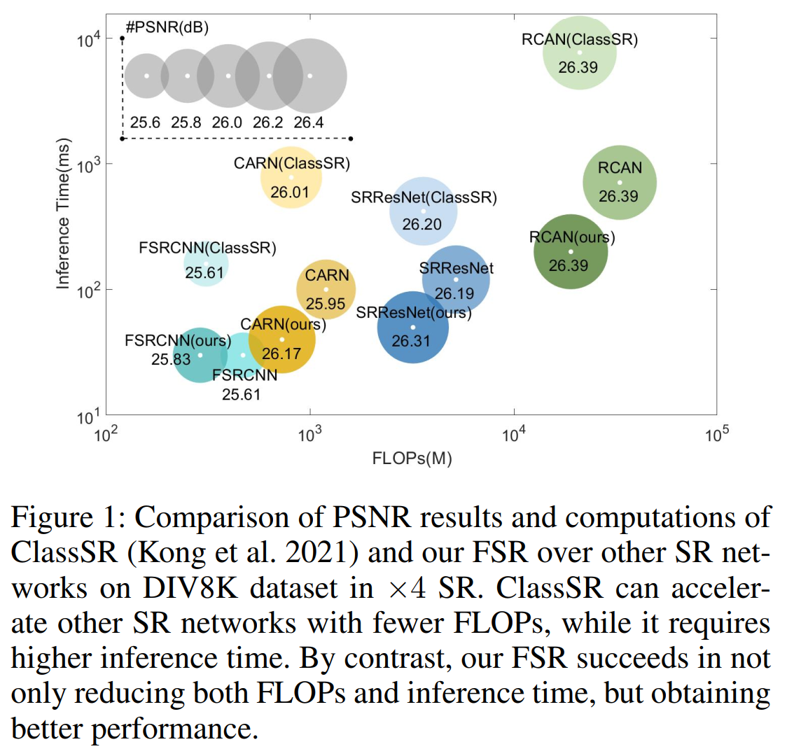
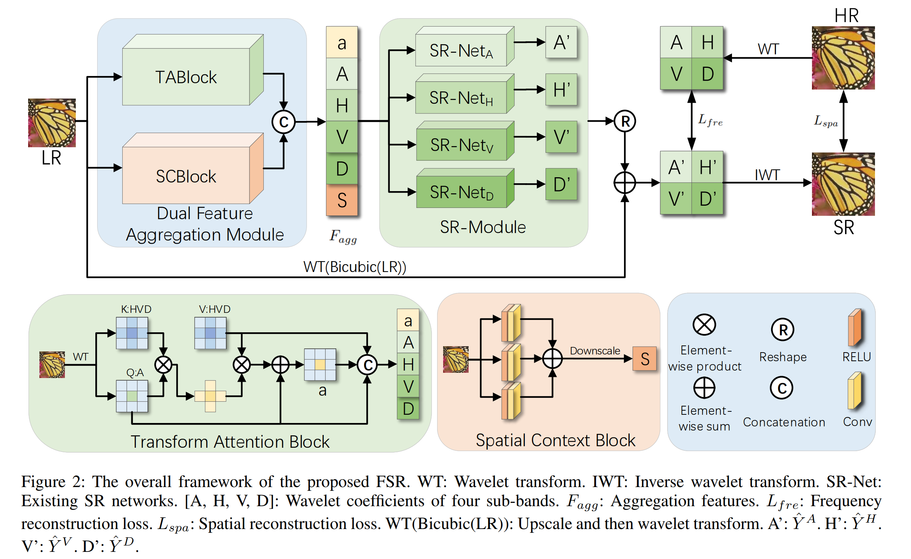
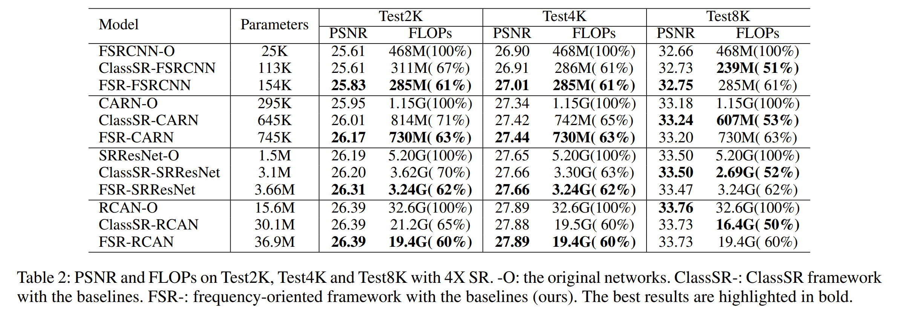

# FSR: A General Frequency-Oriented Framework to Accelerate Image Super-resolution Networks
This is the PyTorch implementation of paper: FSR (AAAI 2023 Oral).



## Framework



## Dependencies

- Python >= 3.6 (Recommend to use [Anaconda](https://www.anaconda.com/download/#linux))
- [PyTorch >= 1.5.0](https://pytorch.org/)
- NVIDIA GPU + [CUDA](https://developer.nvidia.com/cuda-downloads)
- Python packages: `pip install numpy opencv-python lmdb`
- [option] Python packages: [`pip install tensorboardX`](https://github.com/lanpa/tensorboardX), for visualizing curves.

## Codes 
- Our codes version based on [BasicSR](https://github.com/xinntao/BasicSR). 

## Dataset
- All datasets drawn from the existing literature are publicly available. (DIV8K, TEST2K, TEST4K, TEST8K).

## Get Started
### train
```
cd codes
python train.py --whichModule fsrcnn 
# whichModule, choices=['fsrcnn','carn','srresnet','rcan']
```
### test
```
cd codes
python test.py --whichModule fsrcnn 
# whichModule, choices=['fsrcnn','carn','srresnet','rcan']
```
## Result



## Acknowledgement

- The code is based on [BasicSR](https://github.com/xinntao/BasicSR), with reference of [ClassSR](https://github.com/XPixelGroup/ClassSR).

## Contact
- If you have any questions, please contact <ljm22@mails.tsinghua.edu.cn>.
